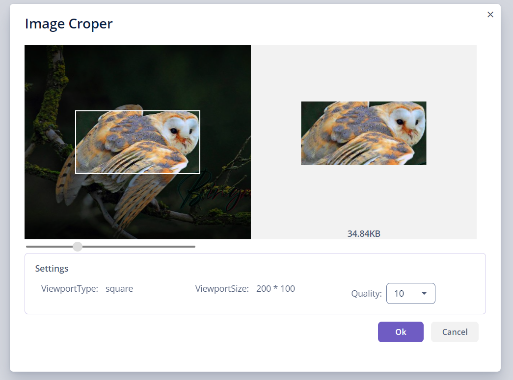

[](http://www.apache.org/licenses/LICENSE-2.0)
 
#### OVERVIEW

In modern enterprise applications, uploading image is a popular requirement, for example, upload ID Card images, avatar images or image attachments etc.
Almost all applications have restriction on image size, in order to reduce upload time and stored file size.

Generally, the original image does not fit the size requirement, we need to process the raw image to fit the application restriction. 
This component will be helpful for processing the original image.              

#### FEATURES
0. Based on the  [Croppie Project](https://github.com/foliotek/croppie), so investigating that project will be helpful before using this component
0. Working with [FileUploadField](https://docs.jmix.io/jmix/ui/vcl/components/file-upload-field.html) from Jmix    
0. Provided a simple API for using the component
0. Provided some options for customize the component appearance, cropping area, image quality etc
0. Reviewing the cropping result in real time

#### Installation <a name="installation"></a>

The add-on can be added to your project in one of the ways described below. Installation from the Marketplace is the simplest way. The last version of the add-on compatible with the used version of the platform will be installed.
Also, you can install the add-on by coordinates choosing the required version of the add-on from the table.

In case you want to install the add-on by manual editing or by building from sources see the complete add-ons installation guide in [Jmix Platform documentation](https://docs.jmix.io/jmix/add-ons.html#installation).

####  From the Marketplace <a name="from-the-marketplace"></a>

1. Open your application in Jmix Studio. Check the latest version of Jmix Studio on the [Jmix site](https://www.jmix.io/tools/).
2. Go to *Settings -> Marketplace* in the Jmix tool window.

 

3. Find the ImageCropper add-on there.

4. Click *Install* and apply the changes.
The add-on corresponding to the used platform version will be installed.

#####  By coordinates <a name="by-coordinates"></a>

1. Open your application in Jmix Studio. Check the latest version of Jmix Studio on the [Jmix Platform site](https://www.jmix.io/tools/).
2. Go to *Settings -> Marketplace* in Jmix tool window.
3. Click the icon in the upper-right corner.
4. Paste the add-on coordinates in the corresponding field as follows:

 `cn.jmix:imagecropper-starter:<add-on version>`

 where `<add-on version>` is compatible with the used version of the Jmix platform.

 | Platform Version | Add-on Version |
|------------------|----------------|
| 1.2.x            | 0.0.2          |
 | 1.3.x-1.4.x      | 0.1.1          |
 | 1.5.x      | 0.2.x          |

5. Click *Install* and apply the changes. The add-on will be installed to your project.

     
#### Screenshot


#### Sample Code
```java
    @Subscribe("cropBtn")
    public void onCropBtnClick(Button.ClickEvent event) {
        UUID fileId = uploadField.getFileId();
        File file = fileUploadingAPI.getFile(fileId);
        if(file==null){
            return;
        }
        // Create an viewport configuration object
        ImgCropServerComponent.ViewPort viewPort =
                new ImgCropServerComponent.ViewPort(200, 100,
                ImgCropServerComponent.ViewPortType.square);
        // Create an option object
        ImageCropWindowOptions options = new ImageCropWindowOptions(file, 10, viewPort);
        // Open a winow for cropping an image
        ImageCropWindow.showAsDialog(this, options, (cropWindowAfterScreenCloseEvent)->{
            // process the cropping result
            if(cropWindowAfterScreenCloseEvent.getCloseAction().equals(WINDOW_DISCARD_AND_CLOSE_ACTION)){
               //cropping window is closed by  "Cancel" button
            }else if(cropWindowAfterScreenCloseEvent.getCloseAction().equals(WINDOW_COMMIT_AND_CLOSE_ACTION)){
                // cropping window is closed  by "ok" button,then we can get the cropping result in bytes.
                byte[] result = options.getResult();
                if (result != null) {
                    //show the cropping result to an image component
                    image.setSource(StreamResource.class)
                            .setStreamSupplier(()-> new ByteArrayInputStream(result)).setBufferSize(1024);
                }
            }
        });
    }
```
#### Sample Application
Clone the root project, the root project is a [composite project](https://docs.jmix.io/jmix/whats-new/index.html#composite-projects) . The  composite project contains a `demo` project ,it's a regular jmix application project ,just run the project from Jmix Studio ,you will see the sample menu and  screens.